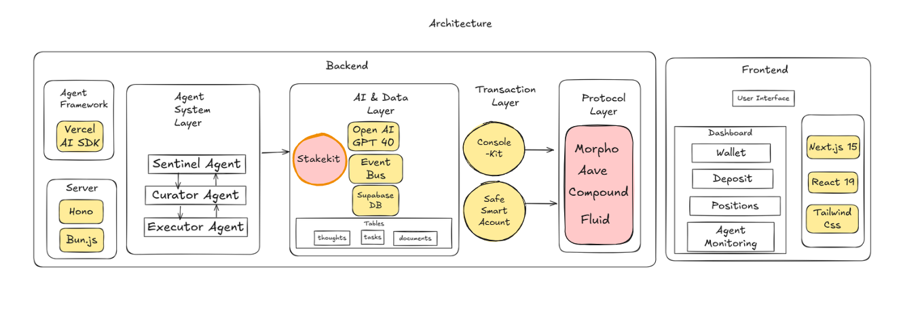
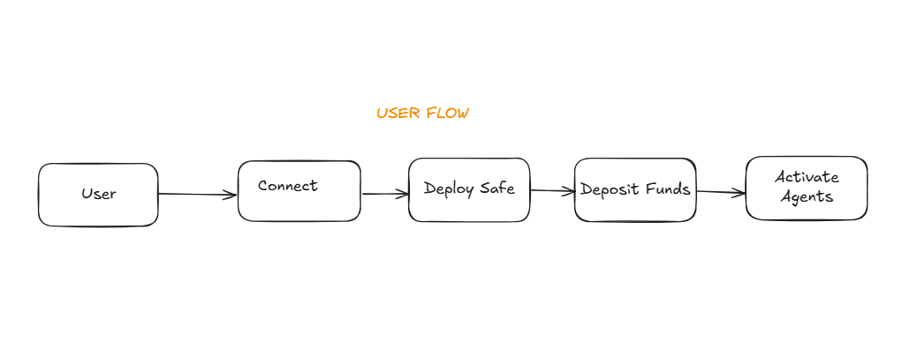

# 🤖 Necta Agents

NectaFi is an autonomous, multi-agent DeFi system that automates stablecoin yield optimization and portfolio management, built on Base. It is powered by Bun, Hono, the Vercel AI SDK, OpenAI, Stakekit, Brahma's ConsoleKit, Safe Smart Account, Supabase, and more.

## Overview 📚

Overview 📚
Necta Agents is an AI-powered DeFi yield automation system that:

-   **Continuously monitors** market conditions and wallet status through **Stakekit APIs**
-   **Identifies optimal yield opportunities** to maximize returns using **Stakekit's real-time yield data**
-   **Executes transactions securely** through **Brahma accounts** (powered by **Safe Smart Account**)
-   **Operates autonomously** with no human intervention required

## System Architecture 🏗️

The system consists of three main AI agents working together:

1. **Sentinel Agent**: Market analysis and opportunity detection

    - Monitors market conditions
    - Tracks wallet status
    - Generates intelligence reports

2. **Curator Agent**: Strategy formulation and task generation

    - Analyzes Sentinel reports
    - Determines optimal actions
    - Curates executable tasks

3. **Executor Agent**: Secure transaction execution
    - Processes tasks into transactions
    - Executes via Brahma ConsoleKit
    - Verifies transaction success

### Architectural Diagram



### User Flow Diagram



### Core Components

1. **Infrastructure**

    - Event Bus: Inter-agent communication system
    - Memory System: Supabase for persistent storage

2. **Data Sources**

    - Market Data: Uses Stakekit yield API for Protocol yields
    - Wallet Status: Account balances and positions

3. Onchain Execution: Brahma ConsoleKit

## Quick Start 🚀

### Prerequisites

-   Hono
-   Bun
-   Supabase account
-   ConsoleKit API key
-   OpenAI API key
-   Vercel AI SDK
-   Brahma ConsoleKit
-   Safe Smart Account
-   Stakekit API key

### Installation

1. Clone and install:

```bash
git clone https://github.com/NectaFi/necta-agents.git
cd necta-agents
bun install
```

2. Configure environment:

```bash
cp .env.example .env
```

### Setup Steps

1. **Register Executor (Gasless)**

```bash
ENABLE_AGENTS=true bun src/index.ts
```

2. **Create Brahma Account**

    - Visit [Console.fi](https://dev.console.fi)
    - Connect wallet (same as executor)
    - Create Brahma account
    - Create subscription with registered executor
    - Fund account with USDC

3. **Add Brahma Account**

```env
BRAHMA_ACCOUNT_ADDRESS="0x..."
```

## Security 🛡️

-   Non-custodial: All funds remain in Brahma account
-   Secure execution: ConsoleKit handles transaction security
-   Limited permissions: Executor only signs transaction data
-   Transaction simulation: All transactions are simulated before execution

## Development Guide 🛠️

### Project Structure

```
src/
├── agents/                    # Agent implementations
│   ├── agent.ts              # Base agent class
│   ├── index.ts              # Agent system initialization
│   ├── curator/              # Curator agent
│   │   ├── index.ts
│   │   └── toolkit.ts
│   ├── executor/             # Executor agent
│   │   ├── index.ts
│   │   └── toolkit.ts
│   └── sentinel/             # Sentinel agent
│       ├── index.ts
│       └── toolkit.ts
├── services/                 # External services integration
│   └── console-kit/          # ConsoleKit integration
│       ├── index.ts
│       ├── core-actions.ts
│       ├── deploy-automation-account.ts
│       ├── register-executor.ts
│       ├── types.ts
│       └── utils.ts
├── system-prompts/          # Agent behavior definitions
│   ├── index.ts
│   ├── curator-system-prompt.ts
│   ├── executor-system-prompt.ts
│   └── sentinel-system-prompt.ts
├── data/                    # Data fetching and processing
│   ├── index.ts
│   ├── stakekit.ts         # Stakekit Integration
│   ├── stakekit.test.ts    # Stakekit Integration test
│   └── types.ts
├── comms/                   # Inter-agent communication
│   ├── index.ts
│   └── event-bus.ts
├── config/                  # Chain and protocol configs
│   ├── index.ts
│   └── chains.ts
├── app.ts                   # Hono app setup
├── env.ts                   # Environment configuration
├── index.ts                # Main entry point
└── setup.ts                # System initialization
```

### Key Files

-   `src/agents/index.ts`: Agent system initialization
-   `src/services/console-kit/`: ConsoleKit integration
-   `src/system-prompts/`: Agent behavior definitions
-   `src/data/`: Stakekit Market data and protocol integrations

### Adding New Features

1. **Extend Agent Capabilities**

    - Add tools in agent's toolkit
    - Update system prompts
    - Register new event handlers

2. **Add Protocol Support**
    - Add protocol addresses
    - Implement data fetching
    - Update transaction building

# Frontend

[Necta App](https://github.com/NectaFi/necta-app)

## Contributing 🤝

## License 📄

MIT License - See [LICENSE](LICENSE) for details

## Disclaimer ⚠️

This code is provided as-is with no guarantees. Not audited. Use at your own risk. Not financial advice.
